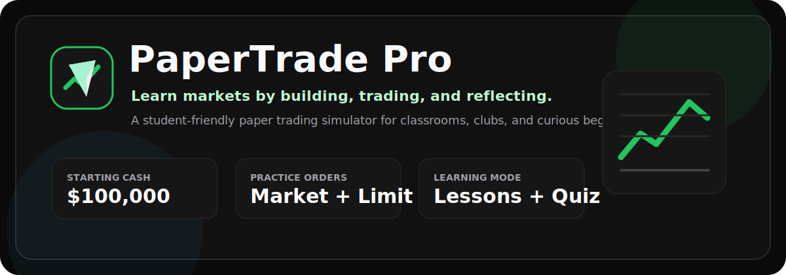

<div align="center">
  
  <h1>PaperTrade Pro</h1>
  <p><strong>An open-source stock market learning simulator for students, beginner investors, and classrooms.</strong></p>

  <p>
    <a href="LICENSE"></a>
    
    
    
  </p>
</div>



PaperTrade Pro gives learners a realistic place to practice trading without risking real money. Users start with virtual cash, build a portfolio, place market and advanced order types, follow live quote updates, review their trade history, compare leaderboard performance, and work through guided lessons on stock market fundamentals.

> Educational simulation only. This project does not place real trades and does not provide financial advice.

## The Big Idea

Learning how markets work is easier when students can make decisions, see consequences, and reflect on their results. PaperTrade Pro is designed to help learners answer practical questions like:

- What happens when I buy or sell shares?
- How do market, limit, stop-loss, and stop-limit orders behave?
- How does portfolio value change as prices move?
- What is diversification, valuation, risk, and market capitalization?
- How can I review my own trading decisions over time?

The goal is to make trading education more hands-on, transparent, and approachable.

## What Students Can Practice

- **Virtual portfolio**: Start with `$100,000` in simulated cash.
- **Paper trading**: Buy and sell supported stocks without real money.
- **Advanced order practice**: Try market, limit, stop-loss, and stop-limit orders.
- **Live market data**: Quote and price history endpoints powered by `yahoo-finance2`.
- **Portfolio dashboard**: Track total value, cash, holdings, gain/loss, and performance history.
- **Trade timeline**: Review previous decisions in a chronological portfolio view.
- **Learning modules**: Built-in tutorials covering stock basics, exchanges, order types, valuation, diversification, and investing concepts.
- **Student assessment**: Lesson content includes quiz-style questions and explanations.
- **Leaderboard**: Compare portfolio values across users or classroom cohorts.
- **AI assistant**: Optional Gemini-powered assistant for educational market discussion.
- **Market and stock news**: Optional OpenAI-powered summaries for current market context.
- **Authentication**: Clerk-powered sign-in for user-specific portfolios.
- **Persistence**: Postgres-backed portfolios, holdings, trades, and performance snapshots.

## Built With

- **Framework**: Next.js 15
- **UI**: React 19, Tailwind CSS, lucide-react
- **Charts**: Recharts
- **Auth**: Clerk
- **Database**: Postgres, designed to work well with Neon
- **Market data**: Yahoo Finance through `yahoo-finance2`
- **AI APIs**: Google Gemini and OpenAI, both optional depending on enabled features
- **Language**: TypeScript

## Quick Start

### Prerequisites

- Node.js 20 or newer
- npm
- A Clerk project for authentication
- A Postgres database if you want persistent portfolios and leaderboards

### 1. Clone the repo

```bash
git clone https://github.com/YOUR_USERNAME/stock-trading-simulator.git
cd stock-trading-simulator
```

### 2. Install dependencies

```bash
npm install
```

### 3. Configure environment variables

Copy the example file and fill in your own credentials:

```bash
cp .env.example .env.local
```

Your local `.env.local` should contain:

```bash
NEXT_PUBLIC_CLERK_PUBLISHABLE_KEY=
CLERK_SECRET_KEY=

DATABASE_URL=

GEMINI_API_KEY=
OPENAI_API_KEY=
```

Required:

- `NEXT_PUBLIC_CLERK_PUBLISHABLE_KEY`
- `CLERK_SECRET_KEY`
- `DATABASE_URL`

Optional:

- `GEMINI_API_KEY` enables the AI assistant.
- `OPENAI_API_KEY` enables market and stock news summaries.

Stock quotes use the local Yahoo Finance API routes, so no separate stock market API key is required.

### 4. Run the development server

```bash
npm run dev
```

Open [http://localhost:3000](http://localhost:3000).

### 5. Build for production

```bash
npm run build
npm run start
```

## Project Map

```text
components/          Main UI views and reusable app components
pages/               Next.js pages and API routes
pages/api/           Quote, news, assistant, and trading API endpoints
server/              Paper trading persistence and portfolio logic
services/            Client-side market data, stock engine, and trading API clients
styles/              Global styles
constants.ts         Starting cash, stock universe, and achievements
types.ts             Shared TypeScript models
```

## How It Works

PaperTrade Pro creates a user portfolio with simulated cash. When a learner places a trade, the app records the transaction, updates holdings and cash, and stores a portfolio snapshot. Live quote updates refresh the market view and portfolio value so students can see how price movement affects their decisions.

The app intentionally separates simulated trading from real brokerage activity. There are no broker connections, no real order routing, and no real-money execution.

## Great For

- High school or college finance classes
- Investing clubs
- Coding students learning full-stack TypeScript
- Personal finance workshops
- Product demos for portfolio, dashboard, and market-data interfaces
- Hackathon projects around financial literacy

## Help Make It Better

Contributions are welcome. Good first areas to improve include:

- New beginner-friendly lessons and quizzes
- Better classroom or league management
- More portfolio analytics
- Additional order simulations
- Accessibility improvements
- Tests for trading calculations and API routes
- Documentation, screenshots, and deployment guides

Before opening a pull request:

1. Run `npm install`.
2. Run `npm run build`.
3. Keep changes focused and explain the learning or simulator value.
4. Avoid adding real-money trading or brokerage execution without a separate design discussion.

## Roadmap

- Teacher dashboards and classroom invites
- Assignment mode with predefined trading scenarios
- Risk metrics such as beta, volatility, drawdown, and Sharpe ratio
- Exportable trade journals
- More guided lessons for technical analysis and fundamental analysis
- Backtesting mode using historical market windows
- Unit and integration test coverage

## Security And Privacy

- Do not commit `.env`, `.env.local`, API keys, database URLs, or Clerk secrets.
- This project stores user profile and simulated trading data.
- Review your deployment provider, Clerk, and database settings before using this in a real classroom.

## License

MIT. See [LICENSE](LICENSE).

## Disclaimer

PaperTrade Pro is for education and simulation only. It is not investment advice, financial advice, tax advice, or a brokerage product. Simulated performance does not represent real market performance, liquidity, fees, slippage, taxes, or execution risk.

## Star History

<a href="https://star-history.com/#juntoku9/stock_trading_sim&Date">
  
</a>
